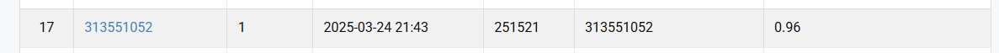
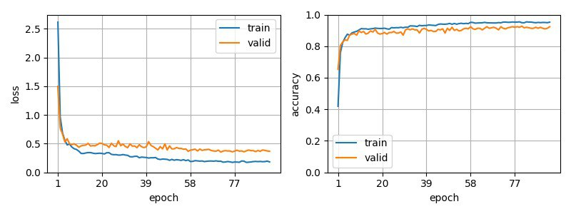

# NYCU Computer Vision 2025 Spring HW1
|StudentID|313551052|
|:-:|:-:|
|Name|王嘉羽 Chia-Yu, Wang|

## Introduction
In this assignment, we aim to train a deep learning model for image classification using a dataset provided for the HW1 Image Classification Problem. Our goal is to develop a model that can accurately predict the class of given test images.

To achieve this, I experimented with different model architectures, including ResNet-50, ResNet-101, ResNeXt-50, and ResNeXt-101. Additionally, I explored various fully connected (FC) layer structures and fine-tuned the learning rate along with the hyperparameters of the CosineAnnealingLR scheduler, such as `T_max` and `eta_min`, to optimize performance. After extensive evaluation, I found that ResNeXt-101, combined with a well-tuned learning rate and CosineAnnealingLR scheduler, achieved the best results. I also applied data augmentation techniques to enhance training robustness and implemented Test-Time Augmentation (TTA) to further improve the model's generalization ability..

The dataset consists of training, validation, and test sets. The model is trained using a cross-entropy loss function, and performance is evaluated based on classification accuracy. Our final model achieves an accuracy of 93% on the validation set and 96% on the public test set, demonstrating its strong generalization capability. I expect to obtain competitive results on the final test set.

## How to install
To install the necessary dependencies for this project, follow these steps:

### 1. Clone the repository
```bash
git clone https://github.com/vayne1125/NYCU-Visual-Recognitionusing-Deep-Learning.git
cd HW1_Image-Classification-Problem
```

### 2. (Optional) Create a virtual environment
It is recommended to use a virtual environment. You can use Anaconda or venv.
For Anaconda (Python 3.11.11):
```bash
conda create --name my_env python=3.11.11
conda activate my_env
```

### 3. Install the dependencies:
```bash
pip install -r requirements.txt
```
You also need to install [PyTorch](https://pytorch.org/). Choose the appropriate CUDA version based on your system. For CUDA 12.4:
```bash
pip install torch torchvision torchaudio --index-url https://download.pytorch.org/whl/cu124
```


### 4. Download the dataset
- Download the dataset from [this link](https://drive.google.com/file/d/1fx4Z6xl5b6r4UFkBrn5l0oPEIagZxQ5u/view)
- After downloading, extract the dataset into the `HW1_Image-Classification-Problem` directory.
- Ensure the directory structure looks like this:
```
HW1_Image-Classification-Problem
├── data
│   ├── test
│   ├── train
│   └── val
├── datasets
│   └── datasets.py
├── requirement.txt
├── params
│   └── best_params.pt
.
.
.
```
### 5. Set `config.yaml`
Before running the model, configure config.yaml based on your needs:
- **For best results**, you can directly run:
```bash
python train.py
python test.py
```

## Performance snapshot
Ranked 12th as of March 24 (with the top 5 marked as N/A).


### About Best Parameter Info
You can directly run `train.py` and `test.py` without modifying config.yaml to use the best settings.
|Parameter|Value|
|:---------:|-----|
| Model   | ResNeXt-101 |
| Pretrained Weight| IMAGENET1K_V2|
|Epochs   |100|
|Batch Size|64|
|Learning Rate|0.0001|
|Optimizer|AdamW|
|Scheduler|	CosineAnnealingLR (Tmax=80, eta_min=0.00001)|
|Criterion|nn.CrossEntropyLoss()|
|Early Stopping|epochs // 5|

Loss and accuracy during training:<br>



|Phase|Accuracy (%)|
|:---------:|:---:|
|Validation | 0.93 |
|Public Test| 0.96 |
