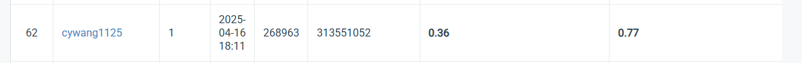

# NYCU Computer Vision 2025 Spring HW2
|StudentID|313551052|
|:-:|:-:|
|Name|王嘉羽 Chia-Yu, Wang|

## Introduction
In this assignment, we aim to train a deep learning model for digit recognition using a dataset provided for the HW2 Digit Recognition Problem. Our goal is to accurately detect the location of each digit in an image and recognize which digit it is.

To achieve this, I experimented with the Faster R-CNN model using a ResNet-50 FPN backbone. I modified the FPN structure, including tuning the anchor sizes to better match the scale of the digits in the dataset. Additionally, I explored various data preprocessing strategies, such as binarization and data augmentation, to improve model robustness and generalization.

The dataset consists of training, validation, and test sets, formatted in COCO style with multiple bounding boxes and digit class annotations per image. The model is trained using a multi-task objective, optimizing both localization and classification accuracy.

Our final model achieves a task1 score of **0.36** and a task2 score of **0.77**, both surpassing the strong baseline benchmarks. These results demonstrate the model's effectiveness in handling both digit detection and recognition under the given dataset conditions.

## How to install
To install the necessary dependencies for this project, follow these steps:

### 1. Clone the repository
```bash
git clone https://github.com/vayne1125/NYCU-Visual-Recognitionusing-Deep-Learning.git
cd HW2_Digit-Recognition-Problem
```

### 2. (Optional) Create a virtual environment
It is recommended to use a virtual environment. You can use Anaconda or venv.
For Anaconda (Python 3.11.11):
```bash
conda create --name my_env python=3.11.11
conda activate my_env
```

### 3. Install the dependencies:
```bash
pip install -r requirements.txt
```
You also need to install [PyTorch](https://pytorch.org/). Choose the appropriate CUDA version based on your system. For CUDA 12.4:
```bash
pip install torch torchvision torchaudio --index-url https://download.pytorch.org/whl/cu124
```


### 4. Download the dataset
- Download the dataset from [this link](https://drive.google.com/file/d/13JXJ_hIdcloC63sS-vF3wFQLsUP1sMz5/view)
- After downloading, extract the dataset into the `HW2_Digit-Recognition-Problem` directory.
- Ensure the directory structure looks like this:
```
HW2_Digit-Recognition-Problem
├── nycu-hw2-data
│   ├── test
│   ├── train
│   └── val
├── datasets.py
├── requirement.txt
├── model.py
│   
.
.
.
```
### 5. Run the Code
- **For best results**, you can simply run the following commands without any additional changes to the configuration:
```bash
python train.py
python test.py
```

## Performance snapshot
Ranked xth as of April 15 (with the top x marked as N/A).


### About Best Parameter Info
You can directly run `train.py` and `test.py` without modifying config.yaml to use the best settings.
| Parameter                | Value                                             |
|:-------------------------|:--------------------------------------------------|
| Model                    | Faster R-CNN (ResNet-50-FPN)                      |
| Pretrained Weight         | `FasterRCNN_ResNet50_FPN_Weights.DEFAULT`         |
| Min Size                 | 512                                                |
| Max Size                 | 1024                                               |
| Anchor Sizes             | `((4,), (8,), (12,), (24,), (48,))`               |
| Aspect Ratios            | `((0.25, 0.5, 1.0),)` (for each anchor size)         |
| Positive Fraction        | 0.25                                              |
| Batch Size per Image     | 512                                                |
| Box NMS Threshold        | 0.3                                               |
| Box Score Threshold      | 0.5                                               |
| Epochs                   | 20                                                 |
| Batch Size               | 8                                                  |
| Learning Rate            | 0.0001                                            |
| Optimizer                | AdamW                                              |
| Weight Decay             | 0.0001                                            |
| Scheduler                | StepLR (`step_size=3`, `gamma=0.1`)               |
| Early Stopping           | 5                                                  |

Loss (Train) and mAP (Validation):<br>


| Phase            | Validation mAP | Public Task1 | Public Task2 |
|:----------------:|:--------------:|:------------:|:------------:|
| Validation      | 0.4633           | -            | -            |
| Public Test     | -              | 0.36         | 0.77         |
