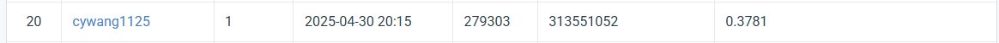
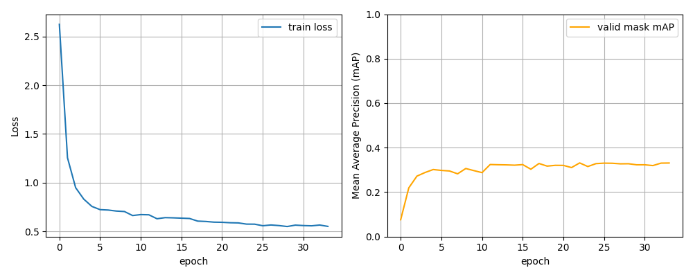

# NYCU Computer Vision 2025 Spring HW3
|StudentID|313551052|
|:-:|:-:|
|Name|王嘉羽 Chia-Yu, Wang|

## Introduction
In this assignment, we aim to train a deep learning model for cell instance segmentation using a biomedical image dataset provided for the HW3 Cell Segmentation task. The objective is to accurately detect and segment up to four types of cells in each image, though some images may contain fewer types. The final segmentation results are encoded using run-length encoding (RLE) and follow the COCO dataset format.

I employed the Mask R-CNN model with a ResNet-50 FPN v2 backbone. During experimentation, I explored various model adjustments, such as modifying the FPN structure, tuning anchor sizes, and adjusting the learning rate schedule through different schedulers. For image preprocessing, I simply converted all images to grayscale to reduce color variance and simplify input channels.

The raw dataset was first converted to the COCO format with instance-level annotations. After training and tuning, the final model achieved a mean average precision (mAP) score of **0.3781** on the public test, demonstrating reasonable segmentation performance on complex biomedical images.


## How to install
To install the necessary dependencies for this project, follow these steps:

### 1. Clone the repository
```bash
git clone https://github.com/vayne1125/NYCU-Visual-Recognitionusing-Deep-Learning.git
cd HW3_Instance-Segmentation
```

### 2. (Optional) Create a virtual environment
It is recommended to use a virtual environment. You can use Anaconda or venv.
For Anaconda (Python 3.11.11):
```bash
conda create --name my_env python=3.11.11
conda activate my_env
```

### 3. Install the dependencies:
```bash
pip install -r requirements.txt
```
You also need to install [PyTorch](https://pytorch.org/). Choose the appropriate CUDA version based on your system. For CUDA 12.4:
```bash
pip install torch torchvision torchaudio --index-url https://download.pytorch.org/whl/cu124
```


### 4. Download the dataset and preprocess
- Download the dataset from [this link](https://drive.google.com/file/d/1B0qWNzQZQmfQP7x7o4FDdgb9GvPDoFzI/view?pli=1)
- After downloading, extract the dataset into the `HW3_Instance-Segmentation` directory.
- Ensure the directory structure looks like this:
```
HW3_Instance-Segmentation
├── data
│   ├── test_release
│   ├── train
│   └── test_image_name_to_ids.json
├── datasets.py
├── requirement.txt
├── model.py
│   
.
.
.
```
- Run ``python process_data.py``

### 5. Run the Code
- **For best results**, you can simply run the following commands without any additional changes to the configuration:
```bash
python train.py
python test.py
```

## Performance snapshot
Ranked 20th as of May 5.


### About Best Parameter Info
You can directly run `train.py` and `test.py` to use the best settings.
| Parameter                | Value                                             |
|:-------------------------|:--------------------------------------------------|
| Model                    | Mask R-CNN (ResNet-50-FPN v2)  with modified poi_head    |
| Pretrained Weight         | `MaskRCNN_ResNet50_FPN_V2_Weights.DEFAULT`         |
| Anchor Sizes             | `((4,), (8,), (12,), (24,), (48,))`               |
| Aspect Ratios            | `((0.25, 0.5, 1.0),)` (for each anchor size)         |
| Epochs                   | 50                                                 |
| Batch Size               | 4                                                  |
| Learning Rate            | 0.005                                            |
| Optimizer                | AdamW                                              |
| Weight Decay             | SGD                                            |
| Scheduler                | WarmupCosineLR                                 |
| Total Iters                | len(train_loader) * num_epochs                                 |
| Warmup Iters                | total_iters // 20                                 |
| Early Stopping           | 10                                                  |

Loss (Train) and mAP (Validation):<br>



| Validation mAP | Public mAP |
|:--------------:|:------------:|
| 0.3314           | 0.3781      |